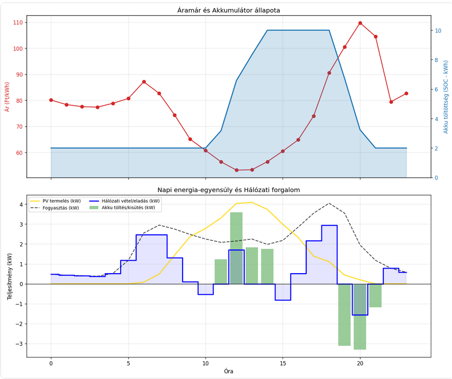
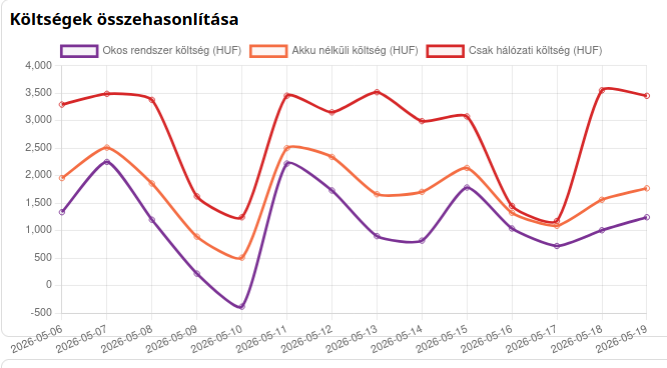

# SmartCity Energy — Project Overview

This small but powerful project demonstrates how local photovoltaic (PV) generation, battery storage, and market-aware scheduling can reduce grid costs and smooth consumption at a site level. Built as a lightweight Python toolkit and single-page webapp, it combines day-ahead price and weather forecasts with a simple optimisation engine to produce hourly charge/discharge schedules that lower energy costs and improve self-consumption.

Under the hood, the `PVBattery` module fetches electricity price time series, weather forecasts and PV production estimates, then formulates a linear optimisation problem to dispatch the battery for minimum cost while respecting state-of-charge (SOC) and power constraints. The backend exposes a minimal Flask API used by the frontend dashboard (`index.html`) to visualise hourly results, historical savings and per-day comparisons.

An additional automation layer runs through GitHub Actions. The scheduled workflow collects and refreshes data in the background, so the project can keep historical results up to date without manual intervention. That makes the repository useful not only as a demo webapp, but also as a reproducible data pipeline for energy monitoring and comparison.

Key features:

- Day-ahead optimisation using market prices and PV forecasts
- Multiple example load profiles (see `data/load_profiles.csv`)
- Simple SQLite caching to store daily and hourly results
- GitHub Actions workflow for automated data collection and refreshes
- Interactive dashboard for daily and aggregated comparisons

Below are two screenshots demonstrating the webapp views.


*Figure: Daily dashboard — hourly price, PV generation, load and battery SOC.*


*Figure: Weekly savings — aggregated cost and savings comparisons across days.*

How to run locally

1. Create and activate a Python virtual environment and install dependencies:

```bash
python -m venv .venv
source .venv/bin/activate
pip install -r requirements.txt
```

2. Set API keys (if available) and start the web server:

```bash
export ENTSOE_API_KEY="<your-key>"
python main.py
```

3. Open the frontend at `http://localhost:5000` (or open `index.html` if served statically). For screenshots:

- Daily dashboard: open the dashboard, pick a date in the date selector, and capture the main chart area showing price, PV, load and battery SOC.
- Weekly comparison: switch to the savings/aggregation view, set the date range to one week, and capture the comparison chart.

Why this matters

Integrating forecasts and storage control at the site level enables tangible cost reductions and a more resilient local energy profile. This repository aims to be a practical starting point for experiments with PV+storage control strategies and visual analysis.